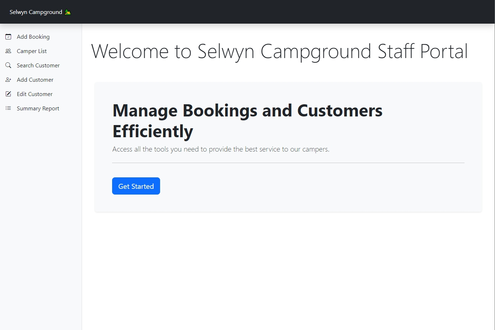
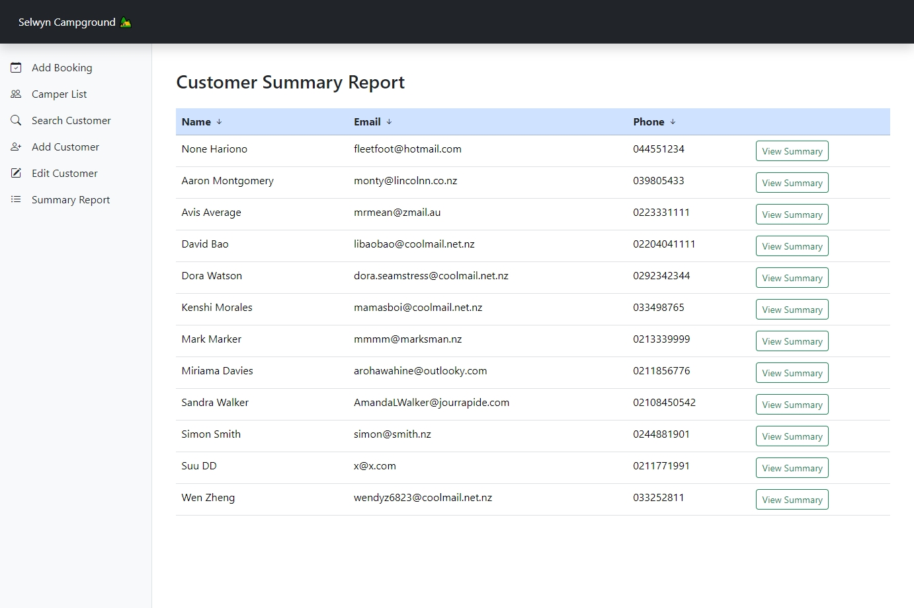

# Selwyn Campground Staff Portal

## Overview
Welcome to the Selwyn Campground Staff Portal Project! This portal is designed to help staff at a campground manage bookings, view camper information, and handle customer data efficiently.

## Live Link 
Check out the live application [here](https://jerboa.pythonanywhere.com/). 🚀

## Getting Started
1. **Home Page**: Start at the home page to get an overview of the portal.
2. **Add Booking**: Navigate to the booking section to create new bookings.
3. **Camper List**: Check the list of campers for any given date.
4. **Search Customer**: Use the search feature to find and manage customer information.
5. **Add or Edit Customer**: Easily add new customers or update existing customer details.
6. **Summary Report**: Access detailed summaries for selected customers.

## Features

### Home Page
The home page provides a welcoming and informative introduction to the portal, making it easy for staff to navigate and find the necessary features.

  

### Booking Management
The booking feature guides users through selecting dates and entering booking details in a step-by-step manner.

**First Step**: Choose the date for the booking, the number of nights, and the number of people.

**Second Step**: Fill in the customer name and select a site.

**Confirmation Page**: Receive a confirmation prompt with booking details once the booking is successfully added.

### Camper Information

**View Campers**: Select a date to view a list of campers staying on that date. This helps staff quickly find and manage camper information.

### Customer Search

**Search Customers**: Enter a search term to find customers quickly. The search results are displayed in an easy-to-read table format.

**View Details**: View customer details from the search results.

**Edit Information**: Update customer information as needed.

**View Summary**: View detailed summary report. 

### Customer Management

**Add Customers**: Fill out a form to add new customers to the database. The form ensures all necessary information is collected correctly.

**Edit Customers**: Update existing customer information using the same form used for adding new customers. This keeps the process consistent and straightforward.

### Customer Summary

**View Summary**: Select a customer to view their detailed summary report. 

The Summary report displays the customer's name, total nights booked, and average occupancy. 

## Navigation
**Sidebar Menu**: A sidebar menu provides clear links to all main features, including bookings, camper list, and customer search. This layout ensures easy navigation and access to different sections of the portal.

## User Experience
- **Consistent Design**: The portal uses a consistent design across all pages, making it easy for staff to learn and use.
- **Data Validation**: Forms include validation to ensure that the information entered is correct and complete.
- **User Feedback**: Success messages and confirmations provide immediate feedback to users, ensuring they know when actions are completed successfully.

## Tech Stack
- **Frontend**: HTML, CSS, Bootstrap
- **Backend**: Python, Flask
- **Database**: MySQL (hosted on PythonAnywhere)
- **Deployment**: Deployed on PythonAnywhere
- **Template Engine**: Jinja2
